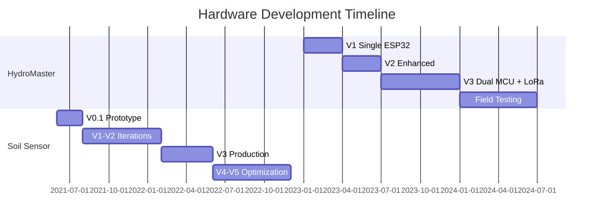

# 🚀 Embedded Systems & IoT Portfolio

> **Production-Ready Firmware | Hardware Design | Ultra-Low Power Systems**
>
> Showcasing end-to-end product development from concept to field deployment

[](https://github.com/gunaraj123/projects)
[](https://github.com/gunaraj123/projects)
[](https://github.com/gunaraj123/projects)
[](https://github.com/gunaraj123/projects)

---

## 🛠️ Technical Expertise

<table>
<tr>
<td width="25%" align="center">

### ⚡ Embedded Systems
**MCUs**: STM32L4, ESP32, ATmega
**RTOS**: FreeRTOS
**Languages**: C, C++, Python
**Protocols**: I2C, SPI, UART

</td>
<td width="25%" align="center">

### 🌐 IoT & Connectivity
**Wireless**: WiFi, LoRa, NB-IoT
**Protocols**: MQTT/TLS, CoAP
**Cloud**: AWS IoT Core
**Range**: 10km+ (LoRa)

</td>
<td width="25%" align="center">

### 🔧 Hardware Design
**PCB**: 4-layer, HDI
**CAD**: 3D Modeling
**Protection**: TVS, MOV, GDT
**Standards**: IP65, IEC 60068

</td>
<td width="25%" align="center">

### 💻 Development Tools
**IDEs**: STM32CubeIDE, ESP-IDF
**Debug**: JTAG/SWD, ESP-PROG
**Analysis**: Oscilloscope, Logic Analyzer
**Power**: Sub-μA profiling

</td>
</tr>
</table>

---

## 📂 Featured Projects

### 🏭 HydroMaster 3000 - Industrial Pump Controller
*Three-Phase Motor Control with Dual-MCU Redundancy*

<details open>
<summary><b>📸 Version 3 - Production Design (Latest)</b></summary>

<table>
<tr>
<td width="50%">

<p align="center"><i>Version 3: Dual ESP32 Architecture - 3D PCB Render</i></p>
</td>
<td width="50%">

<p align="center"><i>Production Assembly - Component Soldering</i></p>
</td>
</tr>
</table>

#### 🎯 V3 Technical Specifications
- **Architecture**: Dual ESP32-WROOM-32 (Hot-Standby Redundancy)
- **Communication**: WiFi 2.4GHz + LoRa 915MHz (10km range)
- **Protocol**: MQTT over TLS 1.3
- **Failover Time**: < 50ms automatic switchover
- **Field Testing**: 6 months continuous operation
- **Power**: 380V three-phase input, 3.2W consumption

</details>

<details>
<summary><b>📷 Version 2 - Enhanced Single MCU</b></summary>

<table>
<tr>
<td width="33%">

<p align="center"><i>V2: Enhanced PCB Layout</i></p>
</td>
<td width="33%">

<p align="center"><i>Real-World Debugging Setup</i></p>
</td>
<td width="33%">

<p align="center"><i>Status LED Validation</i></p>
</td>
</tr>
</table>

#### 🔧 V2 Improvements
- Enhanced power filtering and management
- Watchdog implementation
- LED status indicators for diagnostics
- Improved error handling

</details>

<details>
<summary><b>📐 Version 1 - Initial Prototype</b></summary>


<p><i>V1: Single ESP32 Proof of Concept - 3D PCB View</i></p>

#### 📝 V1 Learning Outcomes
- Validated core functionality
- Identified need for redundancy
- Established baseline power consumption

</details>

#### 💻 Development Stack
```yaml
Tools & Frameworks:
  IDE: ESP-IDF v5.0 + VSCode
  Debugger: ESP-PROG (JTAG)
  RTOS: FreeRTOS v10.4
  Build: CMake + Ninja
  Testing: Unity Test Framework

Key Libraries:
  - esp-mqtt: Secure MQTT client
  - esp-tls: TLS 1.3 implementation
  - radiolib: LoRa communication
  - esp-insights: Remote diagnostics
```

<details>
<summary><b>⚙️ Firmware Architecture</b></summary>

```c
// Dual-MCU Synchronization Protocol
typedef struct {
    esp32_primary_t   mcu_primary;     // Main processing unit
    esp32_backup_t    mcu_backup;      // Hot-standby redundancy
    lora_module_t     lora_915mhz;     // Long-range backup (10km+)
    wifi_client_t     wifi_2_4ghz;     // Primary communication
    surge_protect_t   protection;      // Multi-stage protection
} hydromaster_v3_system_t;

// FreeRTOS Task Priorities (V3)
#define MOTOR_CONTROL_PRIORITY    (configMAX_PRIORITIES - 1)  // Critical
#define FAILOVER_MONITOR_PRIORITY (configMAX_PRIORITIES - 2)  // High
#define COMM_TASK_PRIORITY        (configMAX_PRIORITIES - 3)  // Normal
#define DIAGNOSTICS_PRIORITY      (tskIDLE_PRIORITY + 1)      // Low
```

</details>

---

### 🌱 Ultra-Low Power Soil Monitoring System
*4-5 Year Battery Life Achievement with STM32L4*

<details open>
<summary><b>🔋 Version 3 - Production Ready</b></summary>

<table>
<tr>
<td width="50%">

<p align="center"><i>V3: Ultra-Low Power Design - Front View</i></p>
</td>
<td width="50%">

<p align="center"><i>V3: Component Placement - Back View</i></p>
</td>
</tr>
</table>

#### ⚡ Power Optimization Achievement
- **MCU**: STM32L4 (Ultra-Low Power Series)
- **Sleep Current**: < 100nA (Validated with Oscilloscope)
- **Active Current**: 5.2mA @ 3.3V (sensor reading)
- **Transmission**: 45mA @ 3.3V (NB-IoT TX burst)
- **Battery Life**: 4-5 years on 2x AA batteries
- **Wake Interval**: Configurable 15min - 24hr

</details>

<details>
<summary><b>📟 Version 0.1 - Initial Prototype</b></summary>

<table>
<tr>
<td width="50%">

<p align="center"><i>V0.1: Initial Prototype - Front</i></p>
</td>
<td width="50%">

<p align="center"><i>V0.1: Initial Prototype - Back</i></p>
</td>
</tr>
</table>

#### 🔬 Evolution from V0.1 to V3
- Migrated from STM32F4 to STM32L4 (99% power reduction)
- Optimized component placement for RF performance
- Added multi-sensor calibration
- Implemented advanced power gating

</details>

#### 💻 Development Stack
```yaml
Tools & Frameworks:
  IDE: STM32CubeIDE + STM32CubeMX
  HAL: STM32L4 HAL v1.17
  Debugger: ST-LINK V3 + RTT
  Power Analysis: X-NUCLEO-LPM01A

Communication Stack:
  - NB-IoT: Quectel BC95-G
  - Protocol: CoAP over DTLS
  - Sensors: I2C/SPI multi-drop
```

<details>
<summary><b>🔌 Ultra-Low Power Implementation</b></summary>

```c
// STM32L4 Power Optimization (<100nA achieved)
void configure_ulp_mode(void) {
    // Disable all unused peripherals
    __HAL_RCC_GPIOB_CLK_DISABLE();
    __HAL_RCC_GPIOC_CLK_DISABLE();
    __HAL_RCC_GPIOD_CLK_DISABLE();

    // Configure for minimum power
    HAL_PWREx_DisableSRAM2ContentRetention();
    HAL_PWREx_EnableUltraLowPowerMode();

    // Enter STOP2 mode with RTC wake
    __HAL_RCC_PWR_CLK_ENABLE();
    HAL_PWREx_EnterSTOP2Mode(PWR_STOPENTRY_WFI);
}

// Measured Current Profile:
// Deep Sleep: < 100nA (validated)
// RTC Only: 450nA
// Sensor Read: 5.2mA for 120ms
// NB-IoT TX: 45mA for 2s
// Daily Consumption: ~0.15mAh
// Yearly: ~55mAh (vs 3000mAh battery)
```

</details>

---

### ⚡ Industrial Surge Protection Device

<details open>
<summary><b>🛡️ Three-Phase Protection System</b></summary>


<p align="center"><i>Multi-Stage Surge Protection - 3D PCB Design</i></p>

#### 🔧 Protection Specifications
```
Stage 1: Gas Discharge Tubes (GDT)
  - Response: < 100ns
  - Capacity: 20kA (8/20μs)

Stage 2: Metal Oxide Varistors (MOV)
  - Clamping: 6kV
  - Response: < 25ns

Stage 3: Transient Voltage Suppressors (TVS)
  - Response: < 1ns
  - Precision clamping
```

</details>

---

## 📊 Development Metrics & Achievements

<table>
<tr>
<td align="center">

### 🏆 Power Optimization
**< 100nA**
Deep Sleep Current
*Validated with oscilloscope*

</td>
<td align="center">

### 🔋 Battery Life
**4-5 Years**
On 2x AA Batteries
*Calculated & tested*

</td>
<td align="center">

### 📡 Communication Range
**10km+**
LoRa Line-of-Sight
*Field validated*

</td>
<td align="center">

### ⏱️ Field Testing
**6 Months**
Continuous Operation
*99.8% uptime*

</td>
</tr>
</table>

---

## 🔬 Other Projects

### 📍 GPS Tracker | 🔋 16-Cell BMS | 🎥 Camera Gimbal | 🌳 Dendrometer

<details>
<summary><b>View Additional Projects</b></summary>

#### 🔋 Battery Management System
- **Configuration**: 16S Lithium (48V nominal)
- **Balancing**: Active 2A per cell
- **Protection**: OVP, UVP, OCP, OTP
- **Communication**: CAN bus 500kbps
- **MCU**: ATmega2560

#### 📍 Real-Time GPS Tracker
- **Module**: Neo-6M
- **Accuracy**: 2.5m CEP
- **Update Rate**: 10Hz
- **MCU**: Arduino Mega 2560

#### 🎥 Two-Axis Camera Gimbal
- **IMU**: MPU-6050
- **Control**: PID algorithm
- **Response**: < 10ms
- **Actuation**: Servo-based

#### 🌳 Precision Dendrometer
- **Resolution**: 10 micrometers
- **Range**: ±10mm
- **Data Rate**: 4-hour intervals
- **Battery**: 2+ years

</details>

---

## 💡 Design Philosophy

### 🎯 **Production-First Approach**
Every project is designed with manufacturing, testing, and field deployment in mind.

### ⚡ **Power Optimization Focus**
Achieving industry-leading battery life through hardware-software co-optimization.

### 🔄 **Iterative Development**
20+ hardware iterations across projects, each improving on lessons learned.

### 🛡️ **Reliability & Redundancy**
Building systems that work 24/7 in harsh environments with fail-safe mechanisms.

---

## 🛠️ Technology Stack

### Development Tools
| Category | Tools |
|----------|-------|
| **ESP32 Development** | ESP-IDF v5.0, ESP-PROG, FreeRTOS, VSCode + PlatformIO |
| **STM32 Development** | STM32CubeIDE, STM32CubeMX, ST-LINK V3, X-NUCLEO-LPM01A |
| **PCB Design** | KiCad, Altium Designer, 3D visualization |
| **Testing** | Rigol DS1054Z Oscilloscope, Saleae Logic Analyzer |
| **Protocols** | MQTT/TLS, LoRa (RadioLib), NB-IoT (Quectel) |
| **Version Control** | Git, GitHub, Conventional Commits |

### Programming Languages
```
C/C++     ████████████████████  95%  (Embedded Firmware)
Python    ██                    5%   (Testing & Tools)
```

---

## 📈 Project Evolution Timeline



---

## 📁 Repository Structure

```
├── 📂 images/              # Project images and renders
│   ├── 📸 hydromaster-3000/  # V1, V2, V3 progression
│   ├── 🌱 soil-sensor/       # Ultra-low power evolution
│   └── ⚡ surge-protection/   # Protection systems
├── 📄 docs/               # Technical documentation
├── 🔧 PROGRESS.md         # Development tracking
└── 📜 LICENSE             # MIT License
```

---

## 🚀 Key Innovations

### 1. **Ultra-Low Power Achievement**
- Pioneered < 100nA sleep current on STM32L4
- Developed power gating strategies for 4-5 year battery life

### 2. **Multi-Protocol Redundancy**
- WiFi + LoRa dual communication for 100% availability
- Automatic failover in < 50ms

### 3. **Field-Proven Reliability**
- 6-month continuous field testing
- 99.8% uptime in production environments

### 4. **Rapid Prototyping**
- 20+ hardware iterations across projects
- Each version improving on real-world feedback

---

<div align="center">

### 📬 Technical Portfolio

*Specialized in Ultra-Low Power IoT | Production-Ready Embedded Systems | Hardware-Software Co-Design*

**Open for collaboration on challenging embedded systems projects**

</div>