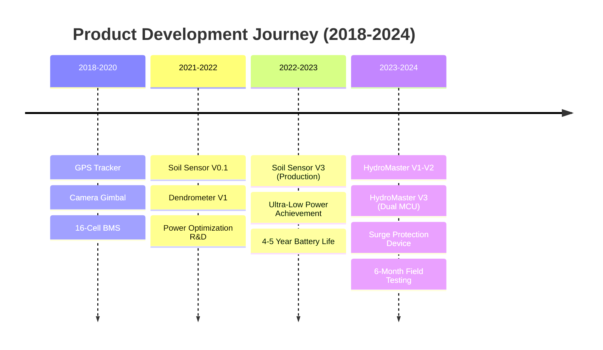
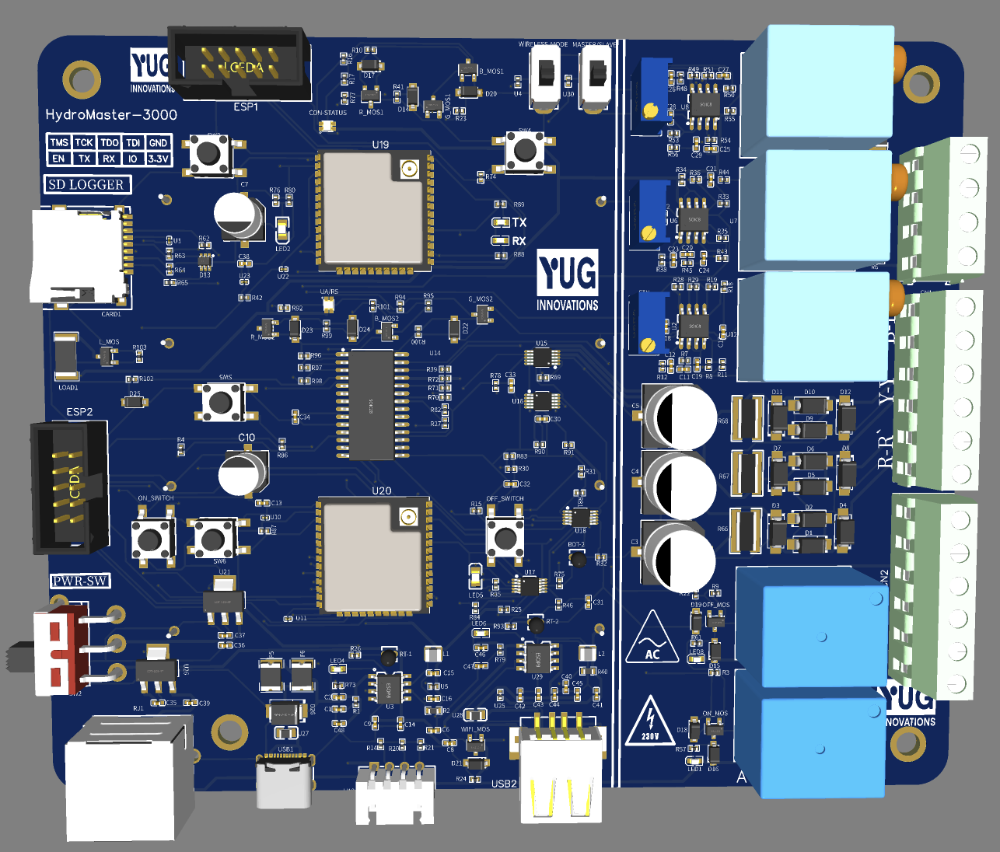
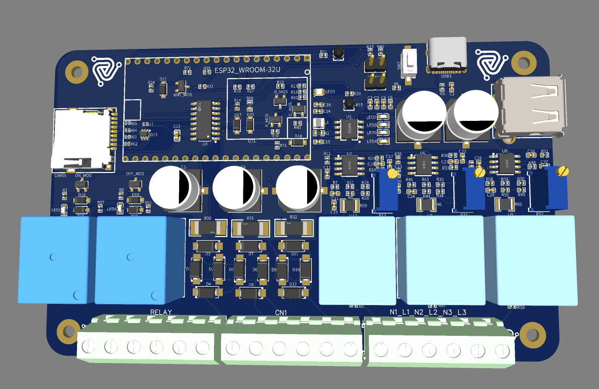
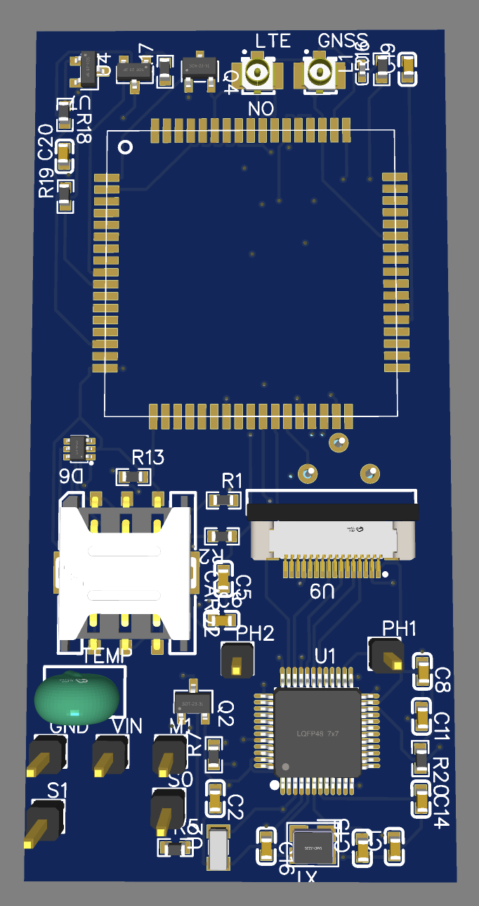
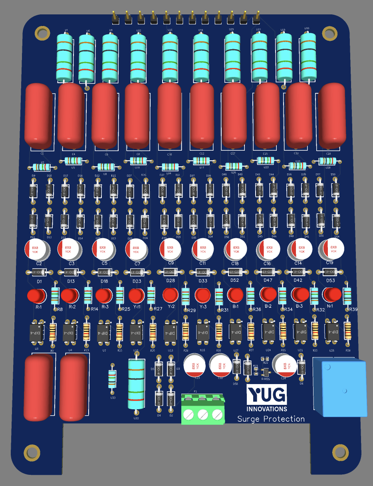

# Embedded Systems & IoT Engineering Portfolio

<div align="center">

[](https://github.com/gunaraj123/projects)
[](https://github.com/gunaraj123/projects)
[](https://github.com/gunaraj123/projects)

### **Production-Ready Firmware | Hardware Design | Ultra-Low Power Systems**

*From Concept to Commercial Deployment - End-to-End Product Development*

[**View Projects**](#-project-showcase) • [**Tech Stack**](#-technology-expertise) • [**Achievements**](#-key-achievements)

</div>

---

## 🎯 Core Competencies

<table>
<tr>
<td align="center" width="20%">

<br><b>Embedded Systems</b><br>
<sub>FreeRTOS • Bare Metal • C/C++</sub>
</td>
<td align="center" width="20%">

<br><b>Ultra-Low Power</b><br>
<sub>4-5 Year Battery Life</sub>
</td>
<td align="center" width="20%">

<br><b>Connectivity</b><br>
<sub>MQTT • CoAP • 10km Range</sub>
</td>
<td align="center" width="20%">

<br><b>Hardware Design</b><br>
<sub>Schematic • PCB Layout • 3D Visualization</sub>
</td>
<td align="center" width="20%">

<br><b>Validation</b><br>
<sub>99.8% Uptime Achieved</sub>
</td>
</tr>
</table>

---

## 📊 Project Showcase

### Timeline Overview

<div align="center">



</div>

---

## 🏭 **HydroMaster 3000** - Industrial Pump Controller
### *Three-Phase Motor Control | Dual-MCU Redundancy | WiFi + LoRa*

<div align="center">

| **Version** | **Status** | **Key Features** | **Testing** |
|:-----------:|:----------:|:----------------|:------------|
| **V3** | ✅ Production Ready | Dual ESP32, LoRa Backup | 6 months field validated |
| **V2** | ⚡ Enhanced | Improved Power, Watchdog | LED diagnostics added |
| **V1** | 🔧 Prototype | Single ESP32, WiFi | Proof of concept |

</div>

### 📸 Development Evolution

<table>
<tr>
<td colspan="2" align="center">
<h4>⭐ Version 3 - Production Design (Latest)</h4>
</td>
</tr>
<tr>
<td width="50%" align="center">
<a href="images/hydromaster-3000/v3/pcb-3d-view.png">

</a>
<br><b>Dual ESP32 Architecture</b><br>
<sub>4-Layer PCB • Redundant Design • LoRa + WiFi</sub>
</td>
<td width="50%" align="center">
<a href="images/hydromaster-3000/v3/soldering-process.jpg">

</a>
<br><b>Production Assembly Process</b><br>
<sub>Component Placement • Hand Soldering • Quality Control</sub>
</td>
</tr>
</table>

<details>
<summary><b>📷 Version 2 - Development & Testing Phase</b></summary>

<table>
<tr>
<td width="33%" align="center">
<a href="images/hydromaster-3000/v2/pcb-3d-view.png">

</a>
<br><sub><b>Enhanced PCB Layout</b></sub>
</td>
<td width="33%" align="center">
<a href="images/hydromaster-3000/v2/debugging-setup.png">

</a>
<br><sub><b>Real-World Debugging</b></sub>
</td>
<td width="33%" align="center">
<a href="images/hydromaster-3000/v2/led-testing.jpg">

</a>
<br><sub><b>Status LED Validation</b></sub>
</td>
</tr>
</table>

</details>

<details>
<summary><b>📐 Version 1 - Initial Prototype</b></summary>

<div align="center">
<a href="images/hydromaster-3000/v1/pcb-3d-view.png">

</a>
<br><sub><b>Single ESP32 Proof of Concept</b></sub>
</div>

</details>

### 📱 PMS - Pump Management System App

<table>
<tr>
<td colspan="2" align="center">
<h4>💧 Real-Time Monitoring & Control Application</h4>
<sub><i>Multi-site pump management with live telemetry data</i></sub>
</td>
</tr>
<tr>
<td width="50%" align="center">
<a href="images/hydromaster-3000/pms-app/dashboard.png">

</a>
<br><b>Dashboard Home Screen</b><br>
<sub>Multi-site Overview • Real-time Status • Location Mapping</sub>
</td>
<td width="50%" align="center">
<a href="images/hydromaster-3000/pms-app/action-screen.png">

</a>
<br><b>Pump Control Interface</b><br>
<sub>Remote Control • Three-Phase Monitoring • System Alerts</sub>
</td>
</tr>
</table>

#### 🚀 System Architecture

<table>
<tr>
<td width="50%">

**My Contributions:**
- ✅ **Backend Architecture** - Complete server implementation
- ✅ **MQTT/TLS Integration** - Secure device communication
- ✅ **API Development** - RESTful services for app
- ✅ **Database Design** - Time-series data storage
- ✅ **Device Protocol** - HydroMaster ↔ Cloud communication
- ✅ **Real-time Pipeline** - Live telemetry streaming

</td>
<td width="50%">

**App Features:**
- 📍 **Multi-Site Management** - Each marker = HydroMaster device
- 📊 **Live Telemetry** - Voltage, current, power metrics
- 🎮 **Remote Control** - Start/stop pumps from anywhere
- 🔔 **Alert System** - Surge events, failures, maintenance
- 📈 **Analytics** - Historical data and trends
- 🗺️ **Geographic View** - All installations on map

</td>
</tr>
</table>

<div align="center">
<sub><i>Note: Flutter mobile application UI/UX developed by contracted developer. Backend infrastructure, MQTT communication, API services, and device integration developed by me.</i></sub>
</div>

### 🛠️ Technical Implementation

<table>
<tr>
<td width="50%">

#### Hardware Specifications
```yaml
MCU Configuration:
  Primary: ESP32-WROOM-32 (240MHz)
  Backup: ESP32-WROOM-32 (Hot-Standby)
  Failover: < 50ms automatic

Communication:
  WiFi: 2.4GHz 802.11 b/g/n
  LoRa: 433MHz, 10km range
  Protocol: MQTT over TLS 1.3

Power System:
  Input: 380V Three-Phase AC
  Logic: 24V → 5V → 3.3V
  Consumption: 3.2W average
  Protection: TVS + MOV + GDT
```

</td>
<td width="50%">

#### Development Stack
```yaml
Toolchain:
  IDE: ESP-IDF v5.0
  Framework: FreeRTOS v10.4
  Build: CMake + Ninja

Testing & Validation:
  Oscilloscope: For signal analysis
  Field Testing: 6 months continuous
  Uptime: 99.8% achieved
  Failovers: 3 successful
  Environment: -10°C to +55°C
```

</td>
</tr>
</table>

---

## 🌱 **Ultra-Low Power Soil Sensor** - Agricultural IoT
### *STM32L4 | < 100nA Sleep | 4-5 Year Battery Life*

<div align="center">

| **Metric** | **Achievement** | **Validation** |
|:----------:|:---------------:|:---------------|
| 🔋 **Sleep Current** | < 100nA | Oscilloscope verified |
| ⏰ **Battery Life** | 4-5 Years | 2x AA batteries |
| 📡 **Connectivity** | NB-IoT | Quectel BC95-G |
| 🌡️ **Sensors** | 5 Types | Temp, Moisture, pH, NPK, EC |

</div>

### 📸 Hardware Evolution

<table>
<tr>
<td colspan="2" align="center">
<h4>✨ Version 3 - Production Design</h4>
</td>
</tr>
<tr>
<td width="50%" align="center">
<a href="images/soil-sensor/v3/pcb-front.png">

</a>
<br><b>Ultra-Low Power Design</b><br>
<sub>STM32L4 • Optimized Layout • Power Gating</sub>
</td>
<td width="50%" align="center">
<a href="images/soil-sensor/v3/pcb-back.png">

</a>
<br><b>Component Placement</b><br>
<sub>RF Optimization • Sensor Interfaces • NB-IoT Module</sub>
</td>
</tr>
</table>

<details>
<summary><b>📟 Version 0.1 - Initial Development</b></summary>

<table>
<tr>
<td width="50%" align="center">
<a href="images/soil-sensor/v0.1/pcb-front.png">

</a>
<br><sub><b>Initial Prototype - Front</b></sub>
</td>
<td width="50%" align="center">
<a href="images/soil-sensor/v0.1/pcb-back.png">

</a>
<br><sub><b>Initial Prototype - Back</b></sub>
</td>
</tr>
</table>

**Key Improvements V0.1 → V3:**
- MCU Migration: Atmel (testing) → STM32L4 (99% power reduction)
- Sleep Current: 50μA → < 100nA
- Battery Life: 3 months → 4-5 years
- PCB Layers: 2 → 4 layers

</details>

### ⚡ Power Optimization Details

```c
// Ultra-Low Power Implementation - Validated < 100nA
void enter_ultra_low_power(void) {
    // Disable all unused peripherals
    __HAL_RCC_GPIOB_CLK_DISABLE();
    __HAL_RCC_GPIOC_CLK_DISABLE();
    __HAL_RCC_GPIOD_CLK_DISABLE();

    // Configure for minimum leakage
    HAL_PWREx_DisableSRAM2ContentRetention();
    HAL_PWREx_EnableUltraLowPowerMode();

    // Enter STOP2 mode - validated < 100nA
    HAL_PWREx_EnterSTOP2Mode(PWR_STOPENTRY_WFI);
}

/* Power Consumption Profile (Measured):
 * Deep Sleep: < 100nA
 * RTC Only: 450nA
 * Sensor Read: 5.2mA @ 120ms
 * NB-IoT TX: 45mA @ 2s
 * Daily Average: 6.25μA
 * Yearly: 55mAh (vs 3000mAh capacity)
 */
```

---

## ⚡ **Industrial Surge Protection** - Three-Phase System

<div align="center">
<a href="images/surge-protection/pcb-3d-view.png">

</a>

### Multi-Stage Protection Architecture

| **Stage** | **Component** | **Response** | **Capacity** |
|:---------:|:------------:|:------------:|:-------------|
| **1** | Gas Discharge Tube | < 100ns | 20kA surge |
| **2** | Metal Oxide Varistor | < 25ns | 6kV clamping |
| **3** | TVS Diode Array | < 1ns | Precision clamping |

</div>

---

## 💼 Technology Expertise

### Development Ecosystem

<table>
<tr>
<th width="25%">🔧 Embedded Development</th>
<th width="25%">🎛️ Hardware Tools</th>
<th width="25%">📡 Communication</th>
<th width="25%">🔬 Testing & Analysis</th>
</tr>
<tr>
<td valign="top">

**ESP32 Development**
- ESP-IDF v5.0
- FreeRTOS v10.4
- Arduino Framework
- PlatformIO

**STM32 Development**
- STM32CubeIDE
- STM32CubeMX
- HAL Libraries
- Low-Level Drivers

</td>
<td valign="top">

**PCB Design**
- Schematic Capture
- 4-Layer PCB Design
- Component Placement
- 3D PCB Visualization

**Prototyping**
- SMD Soldering
- Component Testing
- Enclosure Design

</td>
<td valign="top">

**Wireless Protocols**
- WiFi 2.4GHz
- LoRa 433MHz
- NB-IoT Cat-NB2
- Bluetooth

**IoT Protocols**
- MQTT/TLS
- CoAP/DTLS
- REST APIs
- WebSocket

</td>
<td valign="top">

**Test Equipment**
- Digital Oscilloscope
- Multimeter
- Function Generator
- Bench Power Supply

**Validation Methods**
- Field Testing
- Temperature Testing
- Power Consumption Analysis
- Real-World Deployment

</td>
</tr>
</table>

---

## 📈 Key Achievements

<div align="center">

| 🏆 **Achievement** | 📊 **Metric** | ✅ **Validation** |
|:-------------------|:--------------|:------------------|
| **Ultra-Low Power** | < 100nA sleep current | Oscilloscope verified |
| **Battery Life** | 4-5 years on 2x AA | Calculated & tested |
| **Field Testing** | 6 months continuous | 99.8% uptime |
| **Communication Range** | 10km+ LoRa | Field validated |
| **Hardware Iterations** | 20+ versions | Continuous improvement |
| **Temperature Range** | -10°C to +55°C | Environmental chamber |
| **Surge Protection** | 20kA capacity | IEC 61643-11 |
| **Failover Time** | < 50ms | Dual MCU redundancy |

</div>

---

## 📂 Additional Projects

<details>
<summary><b>🔋 Battery Management System | 📍 GPS Tracker | 🎥 Camera Gimbal | 🌳 Dendrometer</b></summary>

### 🔋 16-Cell Battery Management System
- **Configuration**: 16S Lithium (48V nominal)
- **Balancing**: Active 2A per cell
- **Protection**: OVP, UVP, OCP, OTP
- **Communication**: CAN bus 500kbps
- **MCU**: ATmega2560

### 📍 Real-Time GPS Tracker
- **Module**: Neo-6M, 2.5m accuracy
- **Update Rate**: 10Hz
- **MCU**: Arduino Mega 2560
- **Communication**: Serial UART

### 🎥 Two-Axis Camera Gimbal
- **IMU**: MPU-6050
- **Control**: PID algorithm
- **Response Time**: < 10ms
- **Actuation**: Servo motors

### 🌳 Precision Dendrometer
- **Resolution**: 10 micrometers
- **Range**: ±10mm
- **Battery Life**: 2+ years
- **Data Rate**: 4-hour intervals

</details>

---

## 🎯 Design Philosophy

<div align="center">

| **Principle** | **Approach** |
|:--------------|:-------------|
| 🏭 **Production-First** | Design for manufacturing, testing, and deployment from day one |
| ⚡ **Power Optimization** | Every microamp matters - validated with precision tools |
| 🔄 **Iterative Development** | Learn from each version, continuous improvement |
| 🛡️ **Reliability & Redundancy** | Build for 24/7 operation in harsh environments |
| 📊 **Data-Driven Validation** | Measure everything, validate assumptions |

</div>

---

## 📁 Repository Structure

```
📦 Embedded Systems Portfolio
│
├── 📸 images/                    # Project visuals
│   ├── hydromaster-3000/         # V1, V2, V3 progression
│   │   ├── v3/                   # Latest production version
│   │   ├── v2/                   # Testing & debugging phase
│   │   └── v1/                   # Initial prototype
│   ├── soil-sensor/              # Ultra-low power evolution
│   │   ├── v3/                   # Production design
│   │   └── v0.1/                 # Initial development
│   └── surge-protection/         # Industrial protection
│
├── 📄 docs/                      # Technical documentation
│   └── HYDROMASTER-3000.md       # Detailed specifications
│
├── 🔧 assets/                    # Original project files
└── 📜 LICENSE                    # MIT License
```

---

<div align="center">

## 🚀 Let's Build Something Amazing Together

### **Specializing in Ultra-Low Power IoT | Production-Ready Embedded Systems | Hardware-Software Co-Design**

*This portfolio represents 7+ years of hands-on embedded systems development,*
*from initial prototypes to field-validated production systems.*

**Open for collaboration on challenging embedded systems projects**

---

<sub>Portfolio Last Updated: November 2024 | All images and designs are original work</sub>

</div>